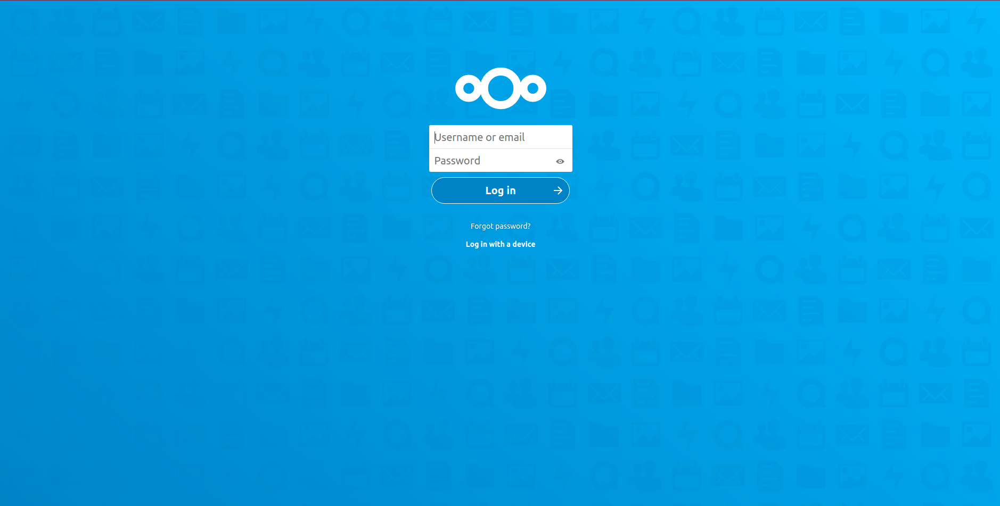

# Dockerized Home Server

Is a set of docker compose to create home server which provides:
- Reverse proxy to use local domain name to access to your different services
- DNS resolver + Ad blocker
- Web space for your different web applications
- Container manager
- Media manager solution
- Resources Monitoring solution
- HTTPS/SSL
- A suite of client-server software for creating and using file hosting services.




## Goto
- [Requirements](#requirements)
- [Optionals](#optionals)
- [Used Containers](#used-Containers)
- [SSL/HTTPS](#sslhttps)
    - [Setup your resolver ](#setup-your-resolver)
    - [Setup a local Root CA](#setup-a-local-root-ca)
    - [Setup a Traefik container with https](#setup-a-traefik-container-with-https)
    - [Nextcloud with https](#nextcloud-with-https)
- [Compose](#compose)
    - [Windows](#windows)
    - [Ubuntu or MacOS](#ubuntu-or-macos)
- [File sharing](#file-sharing)
- [Media Clients](#media-clients)
- [Planing](#planing)
- [FAQ or issues](#faq-or-issues)

## Requirements:
- [Docker](https://docs.docker.com/get-docker/)
- [Docker compose](https://docs.docker.com/compose/install/)
- At least 4GB of RAM
- At least 2 dedicated CPU cores for your docker

## Optionals
If you are willing to access to your services using the generated domain on your host machine then you need to edit your hosts file to support local domain name resolving:
- Linux or MacOS: `/etc/hosts`
- Windows: `c:\windows\system32\drivers\etc\hosts`
```
# Network
127.0.0.1       YOUR_DOMAIN.com
127.0.0.1       traefik.YOUR_DOMAIN.com
127.0.0.1       adguard.YOUR_DOMAIN.com
127.0.0.1       nautilus.YOUR_DOMAIN.com

# Container Manager
127.0.0.1       portainer.YOUR_DOMAIN.com
# Media
127.0.0.1       jackett.YOUR_DOMAIN.com
127.0.0.1       sonarr.YOUR_DOMAIN.com
127.0.0.1       radarr.YOUR_DOMAIN.com
127.0.0.1       bazarr.YOUR_DOMAIN.com

# Monitoring
127.0.0.1       prometheus.YOUR_DOMAIN.com
127.0.0.1       alertmanager.YOUR_DOMAIN.com
127.0.0.1       pushgateway.YOUR_DOMAIN.com
127.0.0.1       grafana.YOUR_DOMAIN.com

#Cloud
127.0.0.1       cloud.YOUR_DOMAIN.com
127.0.0.1       collabora.YOUR_DOMAIN.com
```

## Used Containers
- Network
    - [Traefik](https://hub.docker.com/_/traefik)
    - [Adguard](https://hub.docker.com/r/adguard/adguardhome)
    - [Heimdall](https://hub.docker.com/r/linuxserver/heimdall/)
    - [Static-Files](https://hub.docker.com/r/halverneus/static-file-server)
- Container Manager
    - [Portainer](https://hub.docker.com/r/portainer/portainer/)
- Media
    - [Jackett](https://hub.docker.com/r/linuxserver/jackett/)
    - [Sonarr](https://hub.docker.com/r/linuxserver/sonarr/)
    - [Radarr](https://hub.docker.com/r/linuxserver/radarr/)
    - [Bazarr](https://hub.docker.com/r/linuxserver/bazarr)
- Monitoring (Config from [DockerProm](https://github.com/stefanprodan/dockprom))
    - [Grafana](https://hub.docker.com/r/grafana/grafana/)
    - [Prometheus Pushgateway](https://hub.docker.com/r/prom/pushgateway)
    - [AlterManager](https://hub.docker.com/r/prom/alertmanager/)
    - [Prometheus](https://hub.docker.com/r/prom/prometheus/)
    - [Node-Exporter](https://hub.docker.com/r/prom/node-exporter/)
    - [cAdvisor](https://github.com/google/cadvisor)
- Cloud
    - [Redis](https://hub.docker.com/_/redis)
    - [Postgres](https://hub.docker.com/_/postgres)
    - [Nextcloud](https://hub.docker.com/_/nextcloud)
    - [Collabora/Code](https://hub.docker.com/r/collabora/code)

## SSL/HTTPS
This section: 
- does not cover SSL for windows
- cover only local self signed certificate based on [mkcert](https://github.com/FiloSottile/mkcert)
- all thx go to [traefik-local](https://github.com/SushiFu/traefik-local)

### Setup your resolver 
Let's asume your top level domain name is `com` && `lan`
```sh
# To take into account our local docker resolver
sudo mkdir -p /etc/resolver
echo "your_name_server 127.0.0.1" | sudo tee -a /etc/resolver/com > /dev/null
echo "your_name_server 127.0.0.1" | sudo tee -a /etc/resolver/lan > /dev/null
```

### Setup a local Root CA
#### MacOS
```sh
brew install mkcert
brew install nss # only if you use Firefox

# Setup the local Root CA
mkcert -install
```

#### Ubuntu
```sh
apt install libnss3-tools -y
wget https://github.com/FiloSottile/mkcert/releases/download/v1.4.1/mkcert-v1.4.1-linux-amd64
mv mkcert-v1.4.1-linux-amd64 mkcert
chmod +x mkcert
mv mkcert /usr/local/bin/
mkcert -install
```

### Setup a Traefik container with https
```sh
mkdir ./data/network/traefik/certs
cd ./data/network/traefik/certs
mkcert -cert-file local.crt -key-file local.key "YOUR_DOMAIN.com" "*.YOUR_DOMAIN.com" "YOUR_DOMAIN.lan" "*.YOUR_DOMAIN.lan"
```

### Nextcloud with https
To use SSL with Nextcloud you will need to copy CA root certificate to docker files working directory :  
Run: 
```shell
cp /home/YOUR_USERNAME/.local/share/mkcert/rootCA.pem ./dockerfiles/nextcloud/rootCA.crt
```

## Compose
First you need to provide your configuration.
Create or edit `.env` file(for reference check `.sample.env`):
```
# Network
DOMAIN="YOUR_DOMAIN"
BASIC_AUTH_USER="YOUR_HT_PASSWD"
TRAEFIK_PORT="YOUR_TRAEFIK_PORT"
ADGUARD_PORT="YOUR_ADGUARD_PORT"
HEIMDALL_PORT="YOUR_HEIMDALL_PORT"
DNS1="YOUR_DNS1"
DNS2="YOUR_DNS2"
ROUTER_URL="YOUR_ROUTER_URL"
NAUTILUS_PORT="YOUR_NAUTILUS_PORT"

# Container manager
PORTAINER_PORT="YOUR_PORTAINER_PORT"

# Media
DOWNLOAD_PATH="YOUR_DOWNLOAD_PATH"
TV_PATH="YOUR_TV_PATH"
MOVIE_PATH="YOUR_MOVIE_PATH"
JACKETT_PORT="YOUR_JACKETT_PORT"
SONARR_PORT="YOUR_SONARR_PORT"
RADARR_PORT="YOUR_RADARR_PORT"
BAZARR_PORT="YOUR_BAZARR_PORT"
UTORRENT_URL="YOUR_UTORRENT_URL"

# Monitoring
ADMIN_USER="YOUR_ADMIN_USER"
ADMIN_PASSWORD="YOUR_ADMIN_PASSWORD"
GRAFANA_PORT="YOUR_GRAFANA_PORT"
PUSHGATEWAY_PORT="YOUR_PUSHGATEWAY_PORT"
ALERT_MANAGER_PORT="YOUR_ALERT_MANAGER_PORT"
PROMETHEUS_PORT="YOUR_PROMETHEUS_PORT"

# Cloud
POSTGRES_USER="YOUR_POSTGRESS_USER"
POSTGRES_PASSWORD="YOUR_POSTGRESS_PASSWORD"
POSTGRES_DB="YOUR_DB_NAME"
REDIS_HOST_PASSWORD="YOUR_REDIS_PASSWORD"
COLLABORA_PORT="YOUR_COLLABORA_PORT"
COLLABORA_ADMIN="YOUR_COLLABORA_USER"
COLLABORA_PASS="YOUR_COLLABORA_PASSWORD"
NEXTCLOUD_PORT="YOUR_NEXTCLOUD_PORT"
SMTP_HOST="YOUR_SMPT_HOST" #ex: smtp.gmail.com
SMTP_PORT="YOUR_SMPTY_PORT" #ex: 465
SMTP_SECURE="YOUR_SMTP_SECURE" #ex: ssl
SMTP_AUTHTYPE="YOUR_SMTP_LOGINTYPE" #ex: LOGIN
SMTP_NAME="YOUR_SMPTP_NAME" #ex: YOUR_USER@gmail.com
SMTP_PASSWORD="YOUR_GMAIL_PASS"
MAIL_FROM_ADDRESS="YOUR_MAIL_USER" #ex: YOUR_USER
MAIL_DOMAIN="YOUR_MAIL_DOMAIN" #ex: gmail.com
```
### Windows
Start composing by running `docker-compose-up.ps1` on powershell.

### Ubuntu or MacOS
Start composing by running:
```sh
./docker-compose-up.sh # this will compose containers using https/ssl
./docker-compose-up.sh -s false # this will compose containers without https/ssl
./docker-compose-up.sh -e path/to/your/env # this is if you want to specify another path for your env
```

To stop and remove services run:
```sh
./docker-compose-down.sh # if your containers are not using https then you need to specify -s false
```
** FYI: .sh is also executing another command which will allow containers cloud stack containers to communicate with each other throw Traefik and Adguard **

## File sharing
You may need to setup [Samba](https://hub.docker.com/r/dperson/samba/) sever to share you files or not.

## Media Clients
For my media clients, I'm using Kodi based on NAS Server.

## Planing
* Planing to add hassio with default config for the next days(Only for MacOS/Linux).

## FAQ or Issues:
### I can't access to my services using my domain name !!
Check your router for possible DNS binding protection, if it's the case like FritzBox Router then you need to make an exception for your domain.

### I can't run `ps1` file!!
Run `Set-ExecutionPolicy RemoteSigned` as Admin and follow the instructions.

### Nextcloud is unable to communicate with Collabora/Code !! 
Please make sure that this command was executed by your shell docker composer `docker-compose-up.sh`:
```shell
network_id=$(docker network ls --format "{{.ID}}" --filter name=cloud-net)
sudo iptables -I INPUT 3 -i "br-$network_id" -j ACCEPT
```
