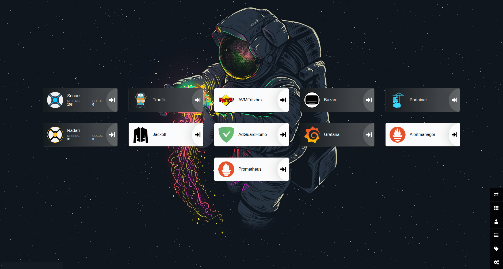

# Dockerized Home Server

Is a set of docker compose to create home server which provides:
- Reverse proxy to use local domain name to access to your different services
- DNS resolver + Ad blocker
- Web space for your different web applications
- Container manager
- Media manager solution
- Resources Monitoring solution



## Goto
- [Requirements](#requirements)
- [Optionals](#optionals)
- [Used Containers](#used-Containers)
- [Deploy](#deploy)
    - [Windows](#windows)
    - [Ubuntu or MacOS](#ubuntu-or-macos)
- [File sharing](#file-sharing)
- [Media Clients](#media-clients)
- [Planing](#planing)
- [FAQ or issues](#faq-or-issues)

## Requirements:
- [Docker](https://docs.docker.com/get-docker/)
- [Docker compose](https://docs.docker.com/compose/install/)
- At least 2GB of RAM
- At least 2 dedicated CPU cores for your docker
- You need to change Adguard default port to `8081` manually during the installation

## Optionals
If you are willing to access to your services using the generated domain on your host machine then you need to edit your hosts file to support local domain name resolving:
- Linux: `/etc/hosts`
- Windows: `c:\windows\system32\drivers\etc\hosts`
```
# Network
127.0.0.1       YOUR_DOMAIN
127.0.0.1       traefik.YOUR_DOMAIN
127.0.0.1       adguard.YOUR_DOMAIN
# Container Manager
127.0.0.1       portainer.YOUR_DOMAIN
# Media
127.0.0.1      	jackett.YOUR_DOMAIN
127.0.0.1       sonarr.YOUR_DOMAIN
127.0.0.1       radarr.YOUR_DOMAIN
# Monitoring
127.0.0.1      	prometheus.YOUR_DOMAIN
127.0.0.1      	alertmanager.YOUR_DOMAIN
127.0.0.1      	pushgateway.YOUR_DOMAIN
127.0.0.1      	grafana.YOUR_DOMAIN
```

## Used Containers
- Network
    - [Traefik](https://hub.docker.com/_/traefik)
    - [Adguard](https://hub.docker.com/r/adguard/adguardhome)
    - [Organizr](https://hub.docker.com/r/organizrtools/organizr-v2/)
- Container Manager
    - [Portainer](https://hub.docker.com/r/portainer/portainer/)
- Media
    - [Jackett](https://hub.docker.com/r/linuxserver/jackett/)
    - [Sonarr](https://hub.docker.com/r/linuxserver/sonarr/)
    - [Radarr](https://hub.docker.com/r/linuxserver/radarr/)
- Monitoring (Config from [DockerProm]())
    - [Grafana](https://hub.docker.com/r/grafana/grafana/)
    - [Prometheus Pushgateway](https://hub.docker.com/r/prom/pushgateway)
    - [AlterManager](https://hub.docker.com/r/prom/alertmanager/)
    - [Prometheus](https://hub.docker.com/r/prom/prometheus/)
    - [Node-Exporter](https://hub.docker.com/r/prom/node-exporter/)
    - [cAdvisor](https://github.com/google/cadvisor)

## Deploy
First you need to provide your configuration:
### Windows
Create or edit `docker-compose-env.ps1`, for reference check `docker-compose-env.default.ps1` :
```powershell
# Network
# Don't forget to rewrite your domain in adguard
$env:DOMAIN = "YOUR_DOMAIN"
# Check https://docs.traefik.io/middlewares/basicauth/
$env:BASIC_AUTH_USER = "YOUR_BASIC_AUTH_USER"
$env:TRAEFIK_PORT = "YOUR_TRAEFIK_PORT"
$env:ADGUARD_PORT = "YOUR_ADGUARD_PORT"
$env:ORGANIZR_PORT = "YOUR_ORGANIZR_PORT"
$env:DNS1 = "YOUR_DNS1"
$env:DNS2 = "YOUR_DNS2"

# Container manager
$env:PORTAINER_PORT = "YOUR_PORTAINER_PORT"

# Media
$env:DOWNLOAD_PATH = "YOUR_DOWNLOAD_PATH"
$env:TV_PATH = "YOUR_TV_PATH"
$env:MOVIE_PATH = "YOUR_MOVIES_PATH"
$env:JACKETT_PORT = "YOUR_JACKETT_PORT"
$env:SONARR_PORT = "YOUR_SONARR_PORT"
$env:RADARR_PORT = "YOUR_RADARR_PORT"

# Monitoring
$env:ADMIN_USER = "YOUR_USERNAME"
$env:ADMIN_PASSWORD = "YOUR_PASSWORD"
$env:GRAFANA_PORT = "YOUR_GRAFANA_PORT"
$env:PUSHGATEWAY_PORT = "YOUR_PUSHGATEWAY_PORT"
$env:ALERT_MANAGER_PORT = "YOUR_ALERT_MANAGER_PORT"
$env:PROMETHEUS_PORT = "YOUR_PROMETHEUS_PORT"

```

Starting composing by running `docker-compose-start.ps1` on powershell.

### Ubuntu or MacOS
Create or edit `docker-compose-env.sh` as executable, for reference check `docker-compose-env.default.sh` :

```sh
# Network
# Don't forget to rewrite your domain in adguard
export DOMAIN="YOUR_DOMAIN"
# Check https://docs.traefik.io/middlewares/basicauth/
export BASIC_AUTH_USER="YOUR_BASIC_AUTH_USER"
export TRAEFIK_PORT="YOUR_TRAEFIK_PORT"
export ADGUARD_PORT="YOUR_ADGUARD_PORT"
export ORGANIZR_PORT="YOUR_ORGANIZR_PORT"
export DNS1 = "YOUR_DNS1"
export DNS2 = "YOUR_DNS2"
# Container manager
export PORTAINER_PORT="YOUR_PORTAINER_PORT"
# Media
export DOWNLOAD_PATH="YOUR_DOWNLOAD_PATH"
export TV_PATH="YOUR_TV_PATH"
export MOVIE_PATH="YOUR_MOVIES_PATH"
export JACKETT_PORT="YOUR_JACKETT_PORT"
export SONARR_PORT="YOUR_SONARR_PORT"
export RADARR_PORT="YOUR_RADARR_PORT"
# Monitoring
export ADMIN_USER="USERNAME"
export ADMIN_PASSWORD="PASSWORD"
export GRAFANA_PORT="YOUR_GRAFANA_PORT"
export PUSHGATEWAY_PORT="YOUR_PUSHGATEWAY_PORT"
export ALERT_MANAGER_PORT="YOUR_ALERT_MANAGER_PORT"
export PROMETHEUS_PORT="YOUR_PROMETHEUS_PORT"
```

Starting composing by running:
```bash
./docker-compose-start.sh
```

To stop and remove services run:
```bash
./docker-compose-down.sh
```

## File sharing
I'm using Windows as host and I'm using Windows SMB to share my files accross my network.

You may need to setup [Samba](https://hub.docker.com/r/dperson/samba/) sever to share you files or not.

## Media Clients
For my media clients, I'm using Kodi based on Windows SMB.

## Planing
I'm planing to add hassio with default config for the next days.

## FAQ or Issues:
### I can't access to my services using my domain name !!
Check your router for possible DNS binding protection, if it's the case like FritzBox Router then you need to make an exception for your domain.

### I can't run `ps1` file!!
Run `Set-ExecutionPolicy RemoteSigned` as Admin and follow the instructions.
